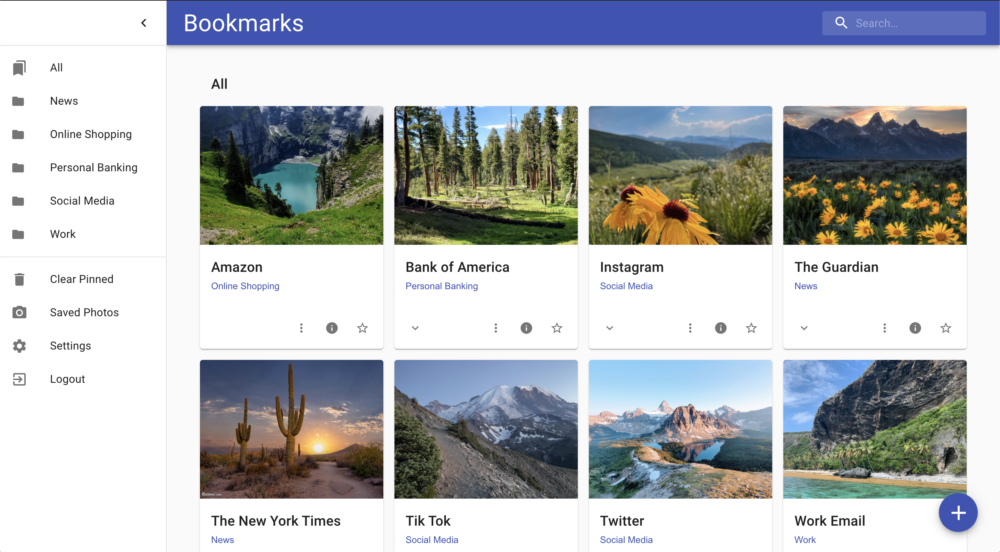
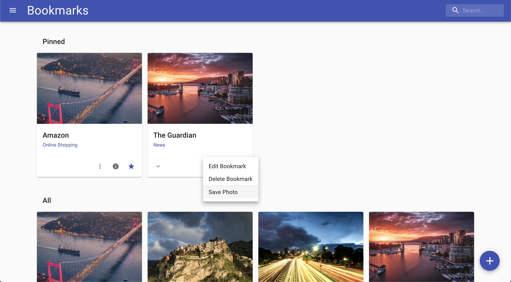
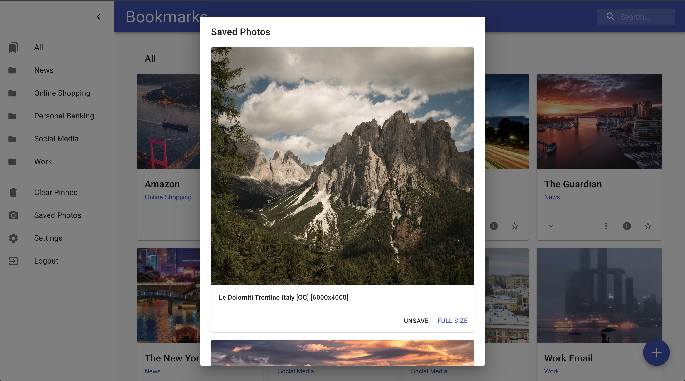
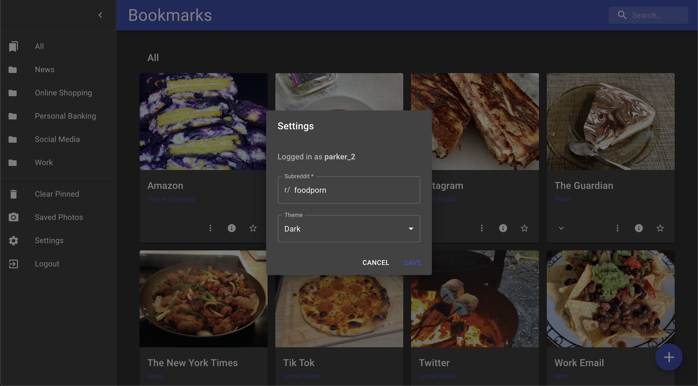

# Bookmarks
With pretty pictures from your favorite subreddit.

## Description
A bookmarks app that displays recently added images from the subreddit of your choosing. When you see a photo that you like that can store it in your collection of saved photos. 

## Main features
- Add, edit, and remove bookmarks
- Search for bookmarks
- Bookmarks are grouped by categories that are accessible in the drawer menu
- Pin frequently used bookmarks to the top of the page
- Change the subreddit used to display photos
  - Determines whether the subreddit exists or not
  - Determines if an existing subreddit is compatible based on how many of the top posts are photos vs text
- Save photos that you like and access them through the drawer menu
- Light and dark themes

## Technology used
MongoDB, Express.js, React with Material UI, Docker

## Related repositories
- [Frontend](https://github.com/parkersiddall/bookmarks_frontend)

# Backend Documentation
The backend is a traditional Express app that contains controllers (api endpoints), models (MongoDB schemas), and middleware. 

## Controllers/routers
Endpoints are split into 4 main routers:
- Users: manages the creation of user accounts and editing user settings
- Login: Used to log users in and issue a JWT
- Bookmarks: Used for creating, editing, and deleting bookmarks
- For testing: A single endpoint used by E2E tests in order to clear the test DB before each test.

## Models
I only use two Mongo schemas for this project:
- Users: contains user data such as username, hashpassword, user settings, and saved photos
- Bookmarks: Contains data about a bookmark

## Tests
The project uses Jest in order to run integration tests and check the API endpoints as well as the DB connection.

# Run locally
In order to run the app locally you need to configure a .env file. Check the sample file to know how to name your variables. I Used MongoDB Atlas, which is easy to set up and get credentials.

## Scripts
Before running any scripts you'll have to run `npm install`

- `npm start`: Start the app in production
- `npm run dev`: Start the development server
- `npm run text`: Runs all the integration test files in the directory
- `npm run start:test`: Used to start the test server for E2E testing via Cypress (see frontend repo)

# Run in a container
Using Docker you can run the app in a container. First adjust the EXPOSE port and CMD based on what environment you are running in (the app defaults to port 3001 if nothing else is specified). 

Navigate into the directory then run the following:
- `docker build . -t bookmarks_backend`
- `docker run -d -p 3001:3001 bookmarks_backend`
